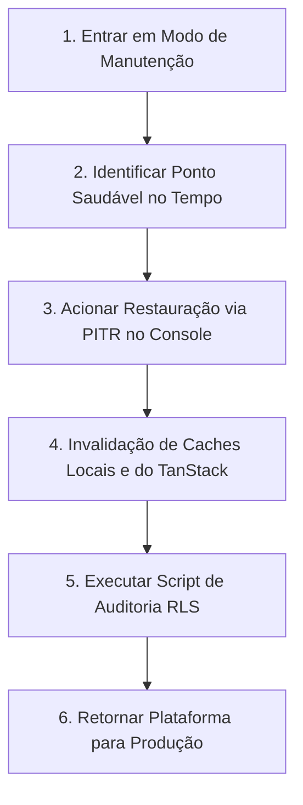

# Guia Operacional de Resiliência, Backup e Recuperação de Desastres

Este documento detalha os procedimentos oficiais e diretrizes operacionais de governança do banco de dados (Supabase PostgreSQL), Edge Functions e mitigação de desastres multi-tenant da plataforma **Global Parts Technology Roadmap**.

---

## 1. Roteiro de Backup do Banco de Dados (Supabase)

A política de proteção de dados exige backups contínuos de integridade lógica e física para evitar qualquer vazamento ou perda de informações transacionais e configurações sensíveis de IA.

### Backup Lógico Automatizado (Diário)
Os backups lógicos diários são gerenciados diretamente pelo console da infraestrutura Supabase Pro/Enterprise com retenção de 7 a 30 dias.
Para backups manuais sob demanda antes de alterações críticas de infraestrutura ou migrações complexas, use a ferramenta CLI do Supabase:

```bash
# Efetuar login no Supabase CLI
supabase login

# Gerar backup local completo dos dados operacionais e de estrutura
supabase db dump --project-ref seu-project-ref -f backup_manual_schema.sql
supabase db dump --project-ref seu-project-ref --data-only -f backup_manual_data.sql
```

### Backups Físicos e Point-in-Time Recovery (PITR)
*   **PITR Habilitado:** Essencial para ambientes de produção. Permite restaurar o banco de dados exatamente para qualquer segundo específico no passado (granularidade de 1 segundo).
*   **Janela de Retenção:** 7 dias para ambientes corporativos padrão.

---

## 2. Timeline e Processo de Restauração (Restore)

Em caso de desastre operacional (por exemplo: remoção acidental massiva de ativos por falha no front-end, ou corrupção de tabelas), o processo de restore deve seguir rigorosamente a seguinte timeline controlada para manter a consistência de Multi-Tenancy:

### Passos de Execução do Restore (Ordem Cronológica)



1.  **Entrar em Modo de Manutenção (D+0 minutos):**
    *   Habilitar tela de manutenção do Vercel/Cloudflare para bloquear conexões ativas e evitar gravações concorrentes durante o restore.
2.  **Identificar o Ponto Saudável no Tempo (D+10 minutos):**
    *   Consultar a tabela `system_telemetry` ou `audit_logs` para descobrir o carimbo de data/hora (`timestamp`) exato imediatamente anterior ao incidente ou falha.
3.  **Acionar Restauração via PITR no Console Supabase (D+15 minutos):**
    *   Navegar para `Database` -> `Backups` -> `Point-in-Time Recovery`.
    *   Inserir o timestamp identificado e disparar o processo.
    *   *Nota: A restauração pode demorar de 10 a 60 minutos dependendo do tamanho da base.*
4.  **Invalidação de Caches Locais e do TanStack (D+ Restore Concluído):**
    *   Ao finalizar, redefinir caches do Redis de borda (Edge Caches) e invalidar sessões ativas caso o incidente envolva credenciais de segurança.
5.  **Executar o Script de Auditoria de RLS (D+ Restore Concluído +5min):**
    *   Executar o arquivo [verify_rls.sql](file:///c:/Users/vfonseca/.gemini/antigravity/scratch/Global-Roadmap/scripts/verify_rls.sql) para garantir que todas as tabelas operacionais restabelecidas permanecem com proteção RLS ativada e sem bypass.
6.  **Retornar a Plataforma para Produção (D+ Restore Concluído +15min):**
    *   Desativar modo de manutenção e validar o acesso de tenants de teste isoladamente.

---

## 3. Procedimentos de Rollback de Edge Functions

Caso uma nova versão de Edge Function (ex: `ai-roadmap-parser`) introduza falhas no parser da Gemini API ou lentidão crônica:

1.  **Visualizar Logs Ativos:**
    ```bash
    supabase functions logs ai-roadmap-parser --project-ref seu-project-ref
    ```
2.  **Executar Rollback Imediato:**
    *   Se estiver usando CI/CD (GitHub Actions), acionar o workflow de rollback redeployando a tag Git estável anterior.
    *   Manualmente via CLI, restaurar o arquivo `index.ts` estável sob a pasta `/supabase/functions/ai-roadmap-parser/` e executar:
    ```bash
    supabase functions deploy ai-roadmap-parser --project-ref seu-project-ref
    ```
3.  **Fallback Automático do Cliente:**
    *   A plataforma possui fallback determinístico local no cliente (`parseLocalDeterministicRegex`) que garante o parser básico mesmo se a Edge Function estiver fora do ar ou em timeout.

---

## 4. Plano de Contingência para Desastres Multi-Tenant

Em sistemas multi-tenant, o maior perigo é o **vazamento cruzado de dados** ou a **deleção indesejada** de dados de um cliente por ação incorreta sobre outro.

### Mitigação de Vazamento ou Exclusão Acidental
*   **Regra de Ouro (Isolamento RLS):** Nunca execute queries SQL diretas em produção sem cláusula `WHERE organization_id = ...`.
*   **Isolamento RLS Automático:** As migrações executam `ALTER TABLE ... ENABLE ROW LEVEL SECURITY;` em todas as tabelas transacionais, forçando o isolamento em nível de banco de dados baseado na claim `organization_id` do JWT do usuário logado.
*   **Recuperação Segmentada de Tenant:**
    *   Se os dados de apenas um tenant específico forem apagados acidentalmente e outros continuarem em operação, **NÃO** restaure a base inteira via PITR, pois isso apagaria o progresso dos demais tenants ativos.
    *   **Solução:** Restaure um backup da base inteira em uma instância temporária separada (staging/sandbox), exporte apenas os dados operacionais pertencentes àquele `organization_id` específico e re-importe para o banco de dados de produção principal.
