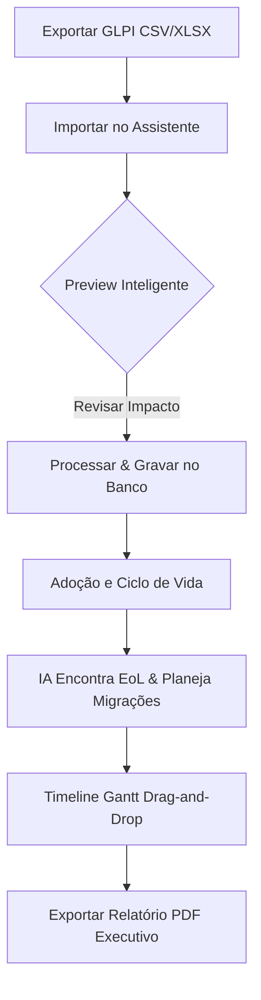

# 🗺️ Global Parts Technology Roadmap
> **Smart Lifecycle Roadmap AI Platform** — Plataforma SaaS corporativa para governança inteligente de TI e gestão estratégica do ciclo de vida tecnológico (Lifecycle & End-of-Life).

---

## 👁️ 1. Visão do Produto
O **Global Parts Technology Roadmap** é uma solução corporativa projetada para simplificar drasticamente a gestão do ciclo de vida de ativos de hardware e software. O sistema resolve o problema clássico de equipes de TI que gastam semanas pesquisando datas de suporte, fim de vida (End-of-Life / EoL) e montando roadmaps de migração em planilhas manuais.

Com uma abordagem **IA-First**, a plataforma automatiza todo o processo:
*   **Importação Tolerante:** Lê exportações diretas do GLPI (CSV/XLSX), normalizando os dados em segundos.
*   **Deduplicação Inteligente:** Resolve duplicatas com base em regras rígidas de prioridade corporativa.
*   **Motor de Inteligência Artificial:** Identifica e enriquece os ativos com dados reais de EoL obtidos diretamente via IA (Gemini API) combinada a um motor de fallback determinístico local.
*   **Timeline Executiva:** Oferece um Gantt interativo drag-and-drop para planejar migrações com extrema facilidade e salvamento otimizado.
*   **Relatórios Executivos:** Exportação em PDF com matriz de risco técnico, simulações financeiras e impacto estratégico.

---

## 🔄 2. Fluxo Principal da Plataforma



1.  **Ingestão de Dados:** O usuário arrasta uma planilha exportada do GLPI.
2.  **Deduplicação & Higienização:** O sistema sanitiza as strings e remove duplicatas com base em cascata (Asset Tag > Serial > Hostname).
3.  **Configuração de Adoção:** O usuário visualiza as tecnologias agregadas e informa (opcionalmente) quando cada uma foi adotada na empresa.
4.  **Enriquecimento & Estratégia:** O motor de IA busca as datas de suporte oficiais e estima o roadmap ideal de migração.
5.  **Ajuste Interativo:** O gestor ajusta as barras de planejamento de migração na Timeline Gantt interativa.
6.  **Apresentação Diretoria:** Geração de PDF pronto com análises de risco técnico e financeiro.

---

## 📥 3. Como Importar do GLPI

Para alimentar a plataforma com inventário real:
1.  No painel do seu **GLPI**, navegue até a visualização de **Computadores** ou **Dispositivos**.
2.  Configure as colunas da tabela para incluir o máximo de detalhes (SO, Versão, Fabricante, Modelo, Serial, Asset Tag, etc.).
3.  Exporte a tabela no formato **CSV** ou **XLSX**.
4.  No Global Parts Technology Roadmap, acesse a aba **Inventário** e clique em **Importar GLPI**.
5.  Arraste o arquivo exportado. O parser mapeará automaticamente as colunas, mesmo que os títulos estejam em português ou inglês (ex: `Sistema operacional` -> `Operating System`).
6.  Confira na tela de **Preview** a quantidade de novos ativos, atualizações de ativos existentes, detecção de erros e colunas mapeadas.
7.  Clique em **Confirmar Importação** para efetivar os dados no Supabase.

---

## ⚡ 4. Geração Automática do Roadmap

Assim que o inventário estiver povoado:
1.  Clique no botão **Gerar Roadmap Automático** localizado na tela de Inventário ou na página de Roadmaps.
2.  O sistema agrupará os ativos por tecnologia (ex: Windows 10, Server 2012 R2, Cisco IOS).
3.  Insira opcionalmente a **Data de Adoção** de cada tecnologia na organização. Caso não possua, o sistema usará datas padrão sem bloquear o fluxo.
4.  O motor de inteligência artificial acionará a Edge Function do Gemini para determinar o ciclo de vida oficial (datas de EoL e fim de suporte estendido) de cada tecnologia.
5.  A IA definirá a prioridade de substituição (Crítica, Alta, Média ou Baixa) com base na proximidade do EoL e gerará os planos de migração.
6.  Você será redirecionado para a **Timeline Gantt**, onde poderá refinar o planejamento arrastando ou redimensionando as barras.

---

## 💾 5. Configuração do Banco de Dados (Supabase)

A plataforma utiliza o Supabase como Backend-as-a-Service (BaaS). Siga as etapas abaixo para configurar o banco:

### Tabelas Principais:
1.  **`user_profiles`**: Cadastro e perfil de usuários corporativos.
2.  **`assets`**: Tabela centralizadora de hardware e software importados do GLPI.
3.  **`roadmaps`**: Registros dos roadmaps globais gerados por projeto.
4.  **`migration_plans`**: Os itens individuais planejados na linha do tempo vinculados às tecnologias e roadmaps.
5.  **`import_history`**: Log de auditoria detalhado das importações.

### Políticas de Segurança (RLS):
Habilite o **Row Level Security (RLS)** em todas as tabelas e configure policies do tipo:
```sql
-- Exemplo para a tabela assets
ALTER TABLE assets ENABLE ROW LEVEL SECURITY;

CREATE POLICY "Users can only view their organization's assets" 
ON assets FOR SELECT 
USING (auth.jwt() ->> 'org_id' = organization_id);
```

---

## 🤖 6. Configuração de Edge Functions (IA)

A orquestração de IA que faz a mineração de dados de EoL é executada em uma Edge Function do Supabase para segurança das chaves de API.

1.  Instale o CLI do Supabase localmente.
2.  Efetue o login no projeto remoto:
    ```bash
    supabase login
    supabase link --project-ref seu-id-do-projeto
    ```
3.  Implante a Edge Function `ai-roadmap-parser`:
    ```bash
    supabase functions deploy ai-roadmap-parser --no-verify-jwt
    ```
4.  Defina a chave do Gemini nos secrets do projeto do Supabase:
    ```bash
    supabase secrets set GEMINI_API_KEY="sua_chave_aqui"
    ```

---

## 🔑 7. Variáveis de Ambiente

Crie um arquivo `.env` na raiz do projeto frontend com as seguintes variáveis:

```env
# URL e chave anônima do Supabase
VITE_SUPABASE_URL=https://sua-url-do-supabase.supabase.co
VITE_SUPABASE_ANON_KEY=eyJhbGciOiJIUzI1NiIsInR5cCI6IkpXVCJ9...

# URL base da aplicação
VITE_APP_URL=http://localhost:5173

# Chave Gemini (Fallback direto se necessário)
VITE_GEMINI_API_KEY=AIzaSy...
```

---

## 🛠️ 8. Comandos de Build & Qualidade (Workaround GPO)

Devido a políticas de segurança e restrições de privilégios de sistema (GPO Windows), evite rodar binários globais ou `npx`. Utilize os atalhos locais mapeados em `node_modules`:

### Verificação de Tipos (TypeScript):
```bash
node node_modules/typescript/bin/tsc -b
```

### Build de Produção (Vite):
```bash
node node_modules/vite/bin/vite.js build
```

### Ambiente de Desenvolvimento:
```bash
npm run dev
```

---

## 🚀 9. Comandos de Deploy

### Deploy do Frontend (Vercel)
A plataforma está pronta para deploy contínuo na Vercel através da integração com o repositório Git:
1.  Conecte seu repositório Git à Vercel.
2.  Configure as variáveis de ambiente (`VITE_SUPABASE_URL` e `VITE_SUPABASE_ANON_KEY`) nas definições da Vercel.
3.  O deploy será automático a cada `git push` na branch `main`.

Se preferir realizar deploy local via CLI da Vercel (evitando npx):
```bash
node node_modules/vercel/bin/index.js --prod
```

### Deploy do Banco (Supabase)
Para aplicar modificações de schema e novas migrations no banco remoto:
```bash
supabase db push
```
